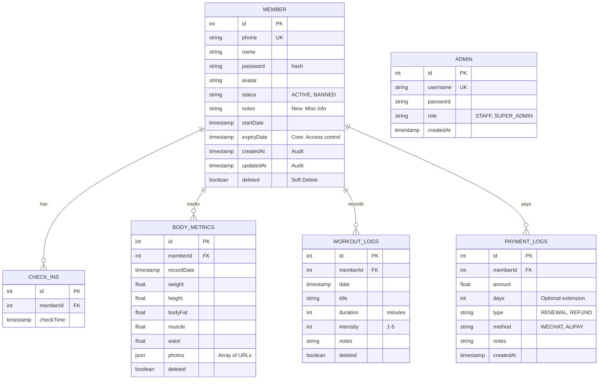

# GymLite - 数据库设计文档 (v2.0)

日期: 2025-12-18

数据库引擎: SQLite (生产环境文件挂载)

ORM 框架: Prisma (Schema First)

核心设计: 单体全栈 / 软删除机制 / 关系型强约束

------

## 1. 实体关系图 (ER Diagram)



------

## 2. 表结构定义 (Table Definitions)

### 2.1 身份与核心资产 (Identity Domain)

#### `Member` (会员表)

核心资产表。参考文档规范，增加了审计时间戳和软删除标记。

| **字段名**     | **类型** | **约束**     | **默认值**        | **说明**                |
| -------------- | -------- | ------------ | ----------------- | ----------------------- |
| **id**         | INT      | PK           | `autoincrement()` | 主键                    |
| **phone**      | STRING   | UK, NOT NULL | -                 | 登录账号/唯一标识       |
| **password**   | STRING   | NOT NULL     | -                 | 加密密码 (Bcrypt)       |
| **name**       | STRING   | NOT NULL     | -                 | 真实姓名                |
| **avatar**     | STRING   | NULL         | -                 | 头像 URL                |
| **status**     | STRING   | NOT NULL     | `'ACTIVE'`        | 状态: ACTIVE, BANNED    |
| **startDate**  | DATETIME | NOT NULL     | `now()`           | 注册时间                |
| **expiryDate** | DATETIME | NOT NULL     | -                 | **核心**: 会员到期日    |
| **createdAt**  | DATETIME | NOT NULL     | `now()`           | **Audit**: 创建时间戳   |
| **updatedAt**  | DATETIME | NOT NULL     | `now()`           | **Audit**: 更新时间戳   |
| **deleted**    | BOOLEAN  | NOT NULL     | `false`           | **Safety**: 软删除标记  |
| **notes**      | STRING   | NULL         |                   | 备注 (如: 特殊病史/VIP) |

#### `Admin` (管理员表)

用于后台管理登录。

| **字段名**    | **类型** | **约束**     | **默认值**        | **说明**                 |
| ------------- | -------- | ------------ | ----------------- | ------------------------ |
| **id**        | INT      | PK           | `autoincrement()` | 主键                     |
| **username**  | STRING   | UK, NOT NULL | -                 | 登录名                   |
| **password**  | STRING   | NOT NULL     | -                 | 加密密码                 |
| **role**      | STRING   | NOT NULL     | `'STAFF'`         | 权限: SUPER_ADMIN, STAFF |
| **createdAt** | DATETIME | NOT NULL     | `now()`           | 创建时间                 |

------

### 2.2 业务数据 (Business Domain)

#### `BodyMetric` (身体数据表)

记录会员身体指标变化。

| **字段名**     | **类型** | **约束** | **默认值**        | **说明**                        |
| -------------- | -------- | -------- | ----------------- | ------------------------------- |
| **id**         | INT      | PK       | `autoincrement()` | 主键                            |
| **memberId**   | INT      | FK       | -                 | 关联 `Member.id`                |
| **recordDate** | DATETIME | NOT NULL | `now()`           | 记录日期                        |
| **weight**     | FLOAT    | NULL     | -                 | 体重 (kg)                       |
| **height**     | FLOAT    | NULL     | -                 | 身高 (cm)                       |
| **bodyFat**    | FLOAT    | NULL     | -                 | 体脂率 (%)                      |
| **muscle**     | FLOAT    | NULL     | -                 | 骨骼肌 (kg)                     |
| **waist**      | FLOAT    | NULL     | -                 | 腰围 (cm)                       |
| **photos**     | STRING   | NULL     | -                 | JSON 字符串: `["url1", "url2"]` |
| **deleted**    | BOOLEAN  | NOT NULL | `false`           | 软删除标记                      |

#### `WorkoutLog` (健身日志表)

会员打卡式训练记录。

| **字段名**    | **类型** | **约束** | **默认值**        | **说明**              |
| ------------- | -------- | -------- | ----------------- | --------------------- |
| **id**        | INT      | PK       | `autoincrement()` | 主键                  |
| **memberId**  | INT      | FK       | -                 | 关联 `Member.id`      |
| **date**      | DATETIME | NOT NULL | `now()`           | 训练日期              |
| **title**     | STRING   | NOT NULL | -                 | 标题 (如: "胸肌训练") |
| **duration**  | INT      | NULL     | -                 | 时长 (分钟)           |
| **intensity** | INT      | NULL     | -                 | 强度 (1-5)            |
| **notes**     | STRING   | NULL     | -                 | 训练备注              |
| **deleted**   | BOOLEAN  | NOT NULL | `false`           | 软删除标记            |

------

### 2.3 运营流水 (Operation Domain)

#### `CheckIn` (签到流水表)

不可变的流水记录，用于统计流量。

| **字段名**    | **类型** | **约束** | **默认值**        | **说明**         |
| ------------- | -------- | -------- | ----------------- | ---------------- |
| **id**        | INT      | PK       | `autoincrement()` | 主键             |
| **memberId**  | INT      | FK       | -                 | 关联 `Member.id` |
| **checkTime** | DATETIME | NOT NULL | `now()`           | 签到时间         |

#### `PaymentLog` (支付/续费流水表)

用于统计消费流水与财务审计。

| **字段名**    | **类型** | **约束** | **默认值**        | **说明**                                                 |
| ------------- | -------- | -------- | ----------------- | -------------------------------------------------------- |
| **id**        | INT      | PK       | `autoincrement()` | 主键                                                     |
| **memberId**  | INT      | FK       | -                 | 关联会员 `Member.id`                                     |
| **amount**    | FLOAT    | NOT NULL | -                 | 金额 (元)                                                |
| **days**      | INT      | NULL     | -                 | 延期天数 (仅续费时有值)                                  |
| **type**      | STRING   | NOT NULL | `RENEWAL`         | 类型: RENEWAL(续费), REFUND(退款), "PURCHASE" (杂项购买) |
| **method**    | STRING   | NULL     | `WECHAT`          | 方式: WECHAT, ALIPAY, CASH                               |
| **createdAt** | DATETIME | NOT NULL | `now()`           | 交易时间                                                 |
| **notes**     | STRING   | NULL     |                   | 备注 (如: 活动优惠)                                      |


------

## 3. Prisma Schema 代码 (Copy & Paste)

您可以直接将以下代码复制到 `prisma/schema.prisma`。

```Prisma
datasource db {
  provider = "sqlite"
  url      = "file:./dev.db"
}

generator client {
  provider      = "prisma-client-js"
  binaryTargets = ["native", "linux-musl-openssl-3.0.x"]
}

// ==============================
// 1. Identity Domain (身份域)
// ==============================

model Member {
  id         Int      @id @default(autoincrement())
  phone      String   @unique
  password   String   // BCrypt hash
  name       String
  avatar     String?
  
  // 状态管理
  // Enum emulation: "ACTIVE", "BANNED", "EXPIRED"
  status     String   @default("ACTIVE") 
  startDate  DateTime @default(now())
  expiryDate DateTime // 核心：鉴权依据
  
  // 简单备注 (用于记录非结构化的续费历史或特殊情况)
  notes      String?

  // 审计与安全
  createdAt  DateTime @default(now())
  updatedAt  DateTime @updatedAt
  deleted    Boolean  @default(false) // 软删除

  // 关联
  checkIns    CheckIn[]
  bodyMetrics BodyMetric[]
  workoutLogs WorkoutLog[]
  paymentLogs PaymentLog[]
  
  @@index([phone]) // 登录查询加速
}

model Admin {
  id        Int      @id @default(autoincrement())
  username  String   @unique
  password  String
  // Enum emulation: "SUPER_ADMIN", "STAFF"
  role      String   @default("STAFF")
  
  createdAt DateTime @default(now())
}

// ==============================
// 2. Business Domain (业务域)
// ==============================

model BodyMetric {
  id         Int      @id @default(autoincrement())
  memberId   Int
  recordDate DateTime @default(now())
  
  weight     Float?
  height     Float?
  bodyFat    Float?
  muscle     Float?
  waist      Float?
  
  // 优化：使用 Json 类型，Prisma Client 自动处理序列化
  // 格式示例: ["https://oss.../1.jpg", "https://oss.../2.jpg"]
  photos     Json?    
  
  deleted    Boolean  @default(false)

  member     Member   @relation(fields: [memberId], references: [id], onDelete: Cascade)
  
  @@index([memberId, recordDate]) // 个人数据看板查询
}

model WorkoutLog {
  id        Int      @id @default(autoincrement())
  memberId  Int
  date      DateTime @default(now())
  
  title     String
  duration  Int?     // 分钟
  intensity Int?     // 1-5
  notes     String?
  
  deleted   Boolean  @default(false)

  member    Member   @relation(fields: [memberId], references: [id], onDelete: Cascade)

  @@index([memberId, date]) // 训练日志查询
}

// ==============================
// 3. Operation Domain (运营域)
// ==============================

// 签到表
model CheckIn {
  id        Int      @id @default(autoincrement())
  memberId  Int
  checkTime DateTime @default(now())

  member    Member   @relation(fields: [memberId], references: [id], onDelete: Cascade)
  
  @@index([checkTime]) // 流量统计
}

// 支付与续费流水表
model PaymentLog {
  id        Int      @id @default(autoincrement())
  memberId  Int
  createdAt DateTime @default(now()) // 交易时间
  
  amount    Float    // 交易金额 (例如: 1200.00)
  days      Int?     // 延期天数 (例如: 365)，如果是单纯购买商品可为空
  
  // 交易类型与方式
  // Enum emulation: "RENEWAL" (续费), "REFUND" (退款), "PURCHASE" (杂项购买)
  type      String   @default("RENEWAL") 
  // Enum emulation: "WECHAT", "ALIPAY", "CASH", "OTHER"
  method    String?  
  
  notes     String?  // 备注 (如: "双十一活动优惠")

  member    Member   @relation(fields: [memberId], references: [id], onDelete: Cascade)

  @@index([memberId]) // 查某人的账单
  @@index([createdAt]) // 查某月的财务
}
```

## 4. 索引设计策略 (Index Strategy)

针对 GymLite 的查询场景，我们在 Prisma 中定义了以下关键索引：

1.  **登录查询优化**: `Member(phone)`
    -   **用途**: 用户登录时 `WHERE phone = ?`，必须保证毫秒级响应。
2.  **个人数据看板**: `BodyMetric(memberId, recordDate)`
    -   **用途**: 绘制体重曲线图时，需要按时间倒序拉取某人的数据。复合索引可避免全表扫描。
3.  **流量统计**: `CheckIn(checkTime)`
    -   **用途**: 管理员看板查询“今日签到人数” (`WHERE checkTime > today_start`)。
4.  **财务审计**: `PaymentLog(createdAt)`
    -   **用途**: 快速生成月度/年度财务报表。

## 5. 外键与删除策略 (FK & Delete)

-   **Cascade (级联删除)**:
    -   当 `Member` 被**物理删除**时，其关联的 `BodyMetric`, `WorkoutLog`, `CheckIn` 也会被物理删除，防止产生孤儿数据。
    -   *注意*：在业务逻辑层面，我们优先使用 `deleted = true` (软删除)，此时数据依然保留，外键约束不会触发。只有在管理员执行“彻底清除数据”操作时，级联删除才会生效。

## 6. 关键业务逻辑实现 (Business Logic & Transactions)

引入 `PaymentLog` 表后，**续费 (Renew)** 业务逻辑必须作为一个“原子操作”处理。这意味着“记录流水”和“更新会员过期时间”必须同时成功，或者同时失败，以保证数据的一致性。

在 Prisma 中，我们使用 `$transaction` 来实现：

``` TypeScript
/**
 * 会员续费核心逻辑 (Transaction)
 * @param memberId 会员ID
 * @param amount 支付金额
 * @param daysToAdd 延期天数
 * @returns 更新后的会员对象
 */
const renewMember = async (memberId: number, amount: number, daysToAdd: number) => {
  return await prisma.$transaction(async (tx) => {
    
    // 1. 获取当前会员信息 (在事务中读取)
    const member = await tx.member.findUniqueOrThrow({ where: { id: memberId } });
    
    // 计算新的过期时间 
    // 逻辑: 如果已过期，从现在开始算；没过期，在原基础上顺延
    const now = new Date();
    const currentExpiry = new Date(member.expiryDate);
    const baseDate = currentExpiry > now ? currentExpiry : now;
    
    const newExpiryDate = new Date(baseDate);
    newExpiryDate.setDate(newExpiryDate.getDate() + daysToAdd);

    // 2. 写入流水记录 (PaymentLog)
    await tx.paymentLog.create({
      data: {
        memberId: memberId,
        amount: amount,
        days: daysToAdd,
        type: 'RENEWAL', // 枚举值
        method: 'WECHAT', // 实际应由前端传入
        notes: `续费 ${daysToAdd} 天`,
      },
    });

    // 3. 更新会员核心字段 (Member)
    const updatedMember = await tx.member.update({
      where: { id: memberId },
      data: {
        expiryDate: newExpiryDate,
        status: 'ACTIVE', // 确保状态被激活
      },
    });

    return updatedMember;
  });
};
```